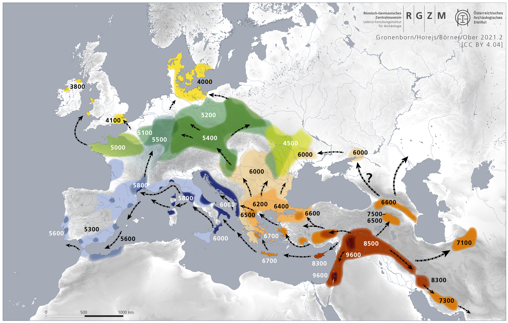
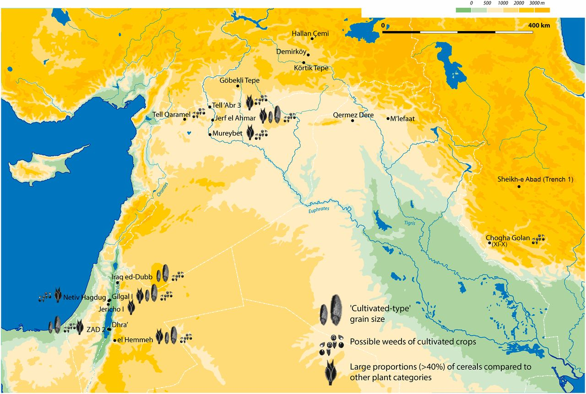
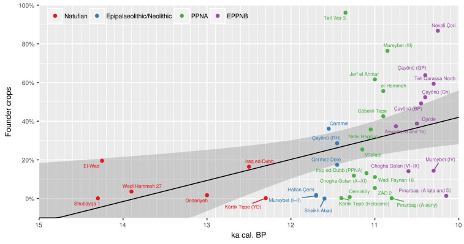
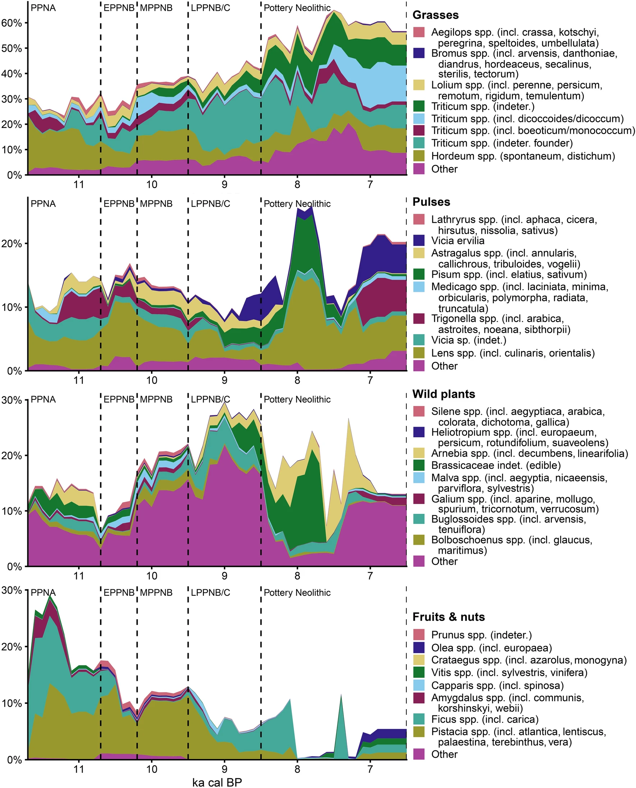
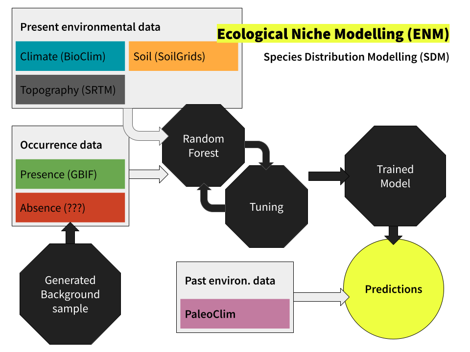
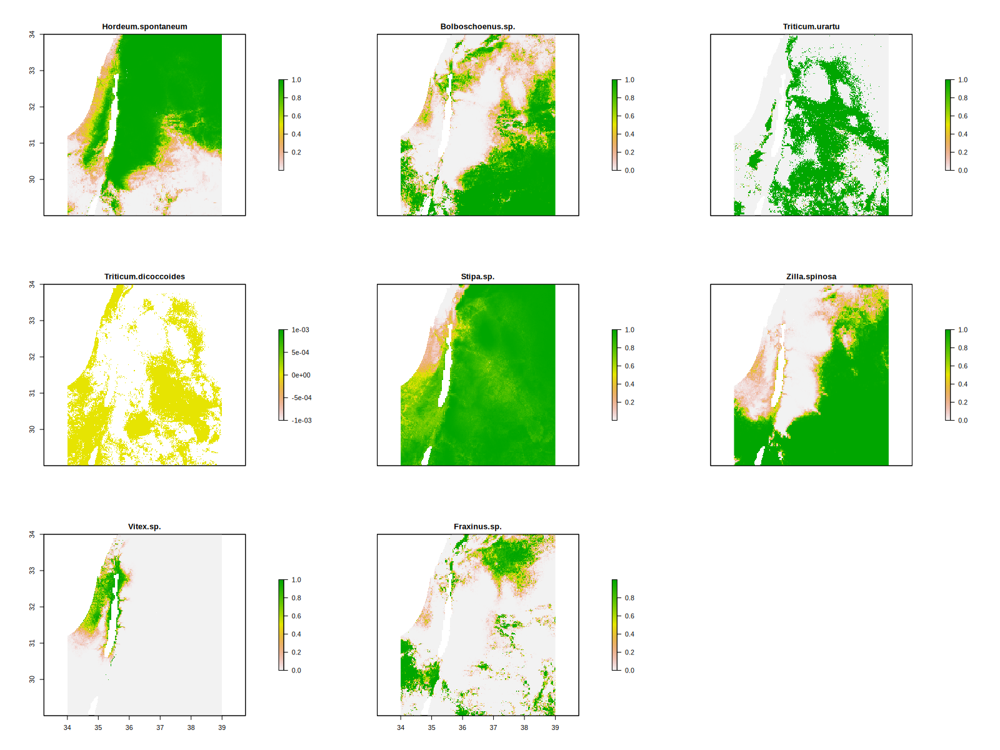
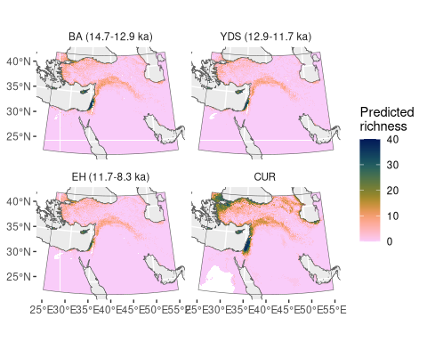
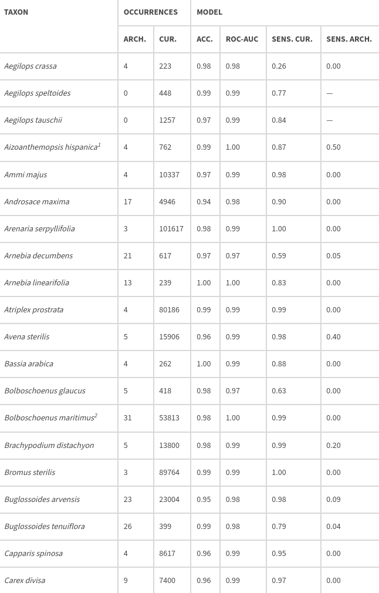
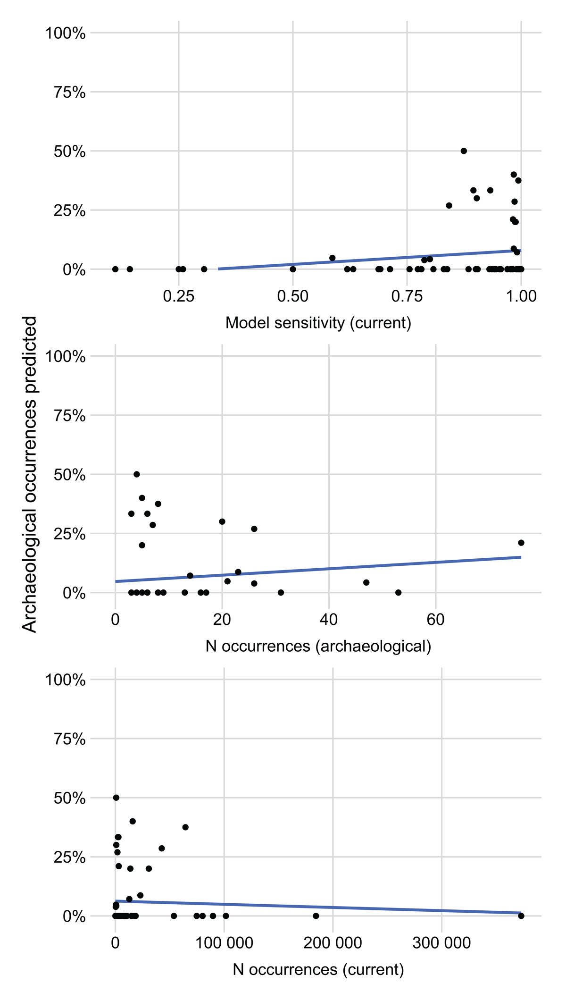

---

:::: {.columns}

::: {.column}

:::

::: {.column}

:::

::::

---

---

---

## {.smaller}

:::: {.columns}

::: {.column}

:::

::: {.column}
### Key findings

* Species ranges likely different & smaller than today
* Ranges shrank c. 25% from Pleistocene to Holocene
* Range of crop progenitors extended to Western Anatolia, Cyprus, Aegean
:::

::::

<small>Roe, J. & Arranz-Otaegui, A., 2026. Biogeography of crop progenitors and wild plant resources in the terminal Pleistocene and Early Holocene of West Asia, 14.7–8.3 ka. *Open Quaternary* 12. <https://doi.org/10.5334/oq.163></small>

---

:::: {.columns}

::: {.column}

:::

::: {.column}

:::

::::

---

## Is the model wrong?

* Heavy spatial bias in occurrence data
* No hyperparameter tuning

---

## Is the archaeology wrong?

* Small samples
* Assemblages aggregated by site-phase
* Poor chronological control

---

## ...or is the concept wrong?

* Fundamental vs. realised niche
* Plasticity unaccounted for
* Human impact unaccounted for
* Time-averaged _in different ways_

---

## Summary {.smaller}

:::: {.columns}

::: {.column}
### Better model
* Spatially stratified sampling
* Per-species hyperparameter tuning
:::

::: {.column}
### Better training data

* More biodiversity surveys in the Middle East
* Century-scale palaeoclimatologies
* Climatic uncertainty/interannual variability
:::

::: {.column}
### Better verification

* Context-level archaeobotanical database
* Refined chronology
:::

::: {.column}
### But can ecological models predict the occurrence of species in the archaeological record?
:::

::::

---

## <small>Can ecological models predict the occurrence of species in the archaeological record? Can I?</small> {.smaller}

Joe Roe, University of Copenhagen

:::: {.columns}

::: {.column}
**Contact**

 <https://joeroe.io>  
 [jar@hum.ku.dk](mailto:jar@hum.ku.dk)  
 [joeroe@archaeo.social](https://archaeo.social/@joeroe)
:::

::: {.column}
**These slides**

 [joeroe.io/caa26_failed_enm](https://joeroe.io/caa26_failed_enm/caa26_failed_enm.html)  
 [joeroe/caa26_failed_enm](https://github.com/joeroe/caa26_failed_enm)  
<!--  [10.5281/zenodo.8416267.](https://doi.org/10.5281/zenodo.8416267) -->
:::

::::

::: aside
Key references
: Arranz-Otaegui, A. & Roe, J. 2023. Revisiting the concept of the 'Neolithic Founder Crops' in southwest Asia. *Vegetation History and Archaeobotany*. <https://doi.org/10.1007/s00334-023-00917-1>
: Brown et al. 2018. PaleoClim, high spatial resolution paleoclimate surfaces for global land areas. *Nature Scientific Data*. <https://doi.org/10.1038/sdata.2018.254>
: Franklin et al. 2015. Paleodistribution modeling in archaeology and paleoanthropology. *Quaternary Science Reviews*. <https://doi.org/10.1016/j.quascirev.2014.12.015>
: **Roe, J. & Arranz-Otaegui, A., 2026.** Biogeography of crop progenitors and wild plant resources in the terminal Pleistocene and Early Holocene of West Asia, 14.7–8.3 ka. *Open Quaternary* 12. <https://doi.org/10.5334/oq.163>
: Valavi et al. 2021. Modelling species presence-only data with random forests. *Ecography*. <https://doi.org/10.1111/ecog.05615>

Acknowledgements
: Amaia Arranz-Otaegui, Alexander Weiss, Peter Yaworsky, Tobias Richter, Martin Hinz, Albert Hafner
: C. L. Davids Fond og Samling, Swiss National Science Foundation, ERC 'PalaeOrigins'
:::

